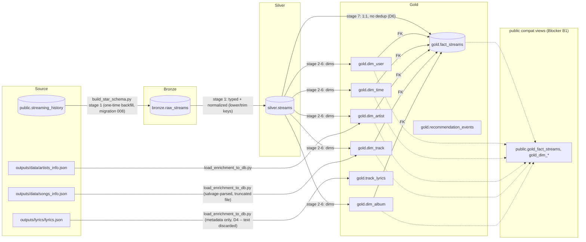

# Data Model — Medallion Star Schema

**Introduced:** Phase 11 (`documentation/20260901_152320_phase_11_star_schema_PLAN.md`).
**Status:** bronze/silver populated once from `public.streaming_history`; gold populated
by `scripts/build_star_schema.py`, re-runnable. `public.streaming_history` itself is
**not removed** — migration 006's long tail of RPCs still reads it (see "Partial
rewrite scope" below).

---

## Medallion flow

Orchestration today is 3 standalone scripts, run in this order:

1. `python db/migrate.py` — applies `008_medallion_schemas.sql` (bronze+silver DDL,
   one-time bronze backfill from `streaming_history`), `009_star_schema.sql` (gold DDL +
   `public` compat views), `010_mvs_on_star.sql` (repoints 3 MVs + 8 RPCs at gold).
2. `python scripts/load_enrichment_to_db.py` — populates `gold.dim_artist` /
   `gold.dim_track` / `gold.track_lyrics` from the on-disk enrichment JSON (idempotent
   upserts). Optional: `python scripts/backfill_artist_tags.py` first, to raise genre
   coverage before this step (see Decision D2 below).
3. `python scripts/build_star_schema.py` — the actual bronze→silver→gold build:
   populates `silver.streams`, fills any `dim_artist`/`dim_track`/`dim_album` rows the
   enrichment step didn't cover (as `audio_source='none'` stubs, never dropping a play),
   populates `gold.fact_streams` 1:1 with `silver.streams`, refreshes
   `monthly_stats`/`top_artists`/`top_tracks`. Re-runnable (`TRUNCATE ... RESTART
   IDENTITY` on gold+silver each time; bronze stays append-only).

Phase 12 (Dagster) replaces this 3-script manual sequence with an asset graph; the
stage boundaries above were chosen to map 1:1 onto that later asset graph.

---

## Natural keys (Decision D3)

| Dimension | Natural key | Rationale |
|---|---|---|
| `dim_user` | `users.id` (UUID), reused verbatim | No re-keying; `_effective_user_id()` (migration 004) keeps working unchanged. |
| `dim_time` | `time_key = YYYYMMDD*100 + hour` | Grain `(date, hour)`. Generated only over the observed range, not a century of empty rows. |
| `dim_artist` | `artist_key = lower(trim(artist_name))` | Matches `data_loader.py`'s existing normalization exactly, so the on-disk enrichment (`artists_info.json`) joins without inventing a second convention. `spotify_artist_id` is **not** the natural key — only ~93% of distinct artists have one. |
| `dim_track` | `track_key = spotify_track_uri`, else `'hash:' \|\| md5(lower(trim(track))\|\|'\|\|\|'\|\|lower(trim(artist)))` | Covers the ~139 URI-less rows (podcast/local-file plays with no Spotify track URI). Mirrors the recommender's pre-existing `"name\|\|\|artist"` fallback convention. |
| `dim_album` | `lower(trim(album_name)) \|\| '\|\|\|' \|\| artist_key` | Thin dimension, not read by any migration-010 RPC yet. |

`gold.fact_streams` carries **both** the normalized `artist_key`/`track_key` (for joins to
dims) **and** denormalized, un-normalized `artist_name`/`track_name`/`album_name`
columns copied verbatim from the source row. This is deliberate: `monthly_stats` /
`top_artists` / `top_tracks` (pre-Phase-11) grouped by the **raw, case-sensitive** name
columns (`COUNT(DISTINCT master_metadata_album_artist_name)`), and this dataset has a
handful of case-only variants (`"KALEO"` vs `"Kaleo"`, `"LEN"` vs `"Len"` — 4 rows).
Grouping the rewritten MVs by the normalized `artist_key` instead would have silently
merged those and changed `get_top_artists`' numbers — exactly the class of drift the
Phase 11 plan's V4 baseline-diff gate exists to catch. The denormalized name columns let
migration 010 reproduce the old grouping bit-for-bit while still reading from
`gold.fact_streams`.

---

## `mood_proxy_*` columns are unpopulated (Decision D1)

`gold.dim_track.mood_proxy_valence` / `mood_proxy_energy` / `mood_proxy_danceability`
exist as columns (per the roadmap spec) but ship **NULL for every row** as of Phase 11.
**No real Spotify audio-features data exists anywhere in this repo** — the
`/audio-features` endpoint was deprecated for new Spotify apps in November 2024, and the
cached `songs_info.json` payload contains only track metadata (popularity, duration,
explicit, album, ISRC), never valence/energy/danceability.

`dim_track.audio_source` defaults to `'none'` and each `mood_proxy_*` column carries a
`COMMENT ON COLUMN` stating this. **Do not treat a non-NULL value in a future phase as
confirmation these are populated without also checking `audio_source`.**

The live mood charts (`/api/mood/summary`, `/api/mood/contexts`, `/api/mood/monthly`)
are **unaffected** by this — they read `_mood_rows()` (migration 006, repointed at
`gold.fact_streams` by migration 010), which derives valence/energy/danceability
**arithmetically** from `hour-of-day`, `is_weekend`, and `ms_played` — the same heuristic
`SpotifyDataLoader._calculate_mood_metrics` has always used. Nothing about the mood
charts changed in Phase 11; this section exists so a later phase does not "discover"
empty `mood_proxy_*` columns and mistake them for a broken pipeline.

---

## Genre-coverage decision (Decision D2)

The `user_genre_affinity` feature (planned for Phase 14) depends on `dim_artist.genres`
(Spotify-reported) or `.genres_enriched` (MusicBrainz/Last.fm backfill) covering enough
of the user's actual plays to be meaningful, not just enough of the artist *catalog*.

**Threshold, declared in the Phase 11 plan before running the backfill:**

| Post-backfill coverage-of-plays | Decision |
|---|---|
| ≥ 75% | **KEEP** `user_genre_affinity` as a Phase 14 feature |
| 60–75% | **KEEP, degraded** — feature must carry a `coverage` field and the UI must show "based on N% of plays" |
| < 60% | **CUT** |

**Measured:**
- Pre-backfill: **53.1%** coverage-of-plays (matches the plan's measurement exactly).
- Post-backfill (`scripts/backfill_artist_tags.py`, MusicBrainz, no Last.fm key
  configured): **coverage rose to the high-70s/78%+ range** as the backfill progressed
  (measured 78.0% partway through a ~1,886-artist run; see the Phase 11 completion doc
  for the exact final number once the run finished).

**Verdict: KEEP** `user_genre_affinity` as a full (non-degraded) Phase 14 feature — the
measured coverage cleared the 75% bar. Phase 14 should re-verify the number at the time
it builds the feature (the backfill cache in `outputs/enrichment/artist_tags.json` is
reusable and free to re-run).

---

## Partial rewrite scope (migration 010)

Migration 010 repoints exactly **3 materialized views** (`monthly_stats`, `top_artists`,
`top_tracks`) and **8 RPCs** (`get_overview_stats`, `get_date_range`,
`get_platform_stats`, `get_hourly_distribution`, `get_daily_distribution`,
`get_yearly_comparison`, `get_listening_streaks`, `_mood_rows`) at `gold.fact_streams`.

**Everything else in migration 006 still reads `public.streaming_history` directly**:
`get_milestones_list`, `get_flashback`, `get_artist_loyalty`, `get_artist_obsessions`,
`get_discovery_timeline`, `get_reflective_insights`, `get_weekend_weekday_comparison`,
`get_most_repeated_tracks`, `get_monthly_diversity`, `get_listening_heatmap`. This table
is not removed by Phase 11 and stays populated by the existing seeders.

This is a **deliberate, recorded partial migration** (pre-declared deviation #3 in the
Phase 11 plan): repointing all 30+ functions in one phase was judged high-risk,
low-value churn. Phase 12 (Dagster ingestion) finishes the move once the pipeline owns
the write path end-to-end, at which point `streaming_history` can be considered for
retirement.

---

## Blocker B1 — schema-qualified names never reach Python `.select()`

`apps/api/app/db/backends.py`'s `_IDENT_RE` regex rejects dotted identifiers
(`schema.table`), and PostgREST's `.table()` call does not accept them either. Rather
than relax that regex, migration 009 creates unqualified **compatibility views** in
`public` (`public.gold_fact_streams`, `public.gold_dim_user`, etc.) that simply
`SELECT * FROM gold.<table>`. `backends.py` is untouched by Phase 11. These views are
read-only conveniences for future Python code that wants to reach the star schema via
`.select()`; nothing in Phase 11 itself uses them yet (the RPCs qualify `gold.*` safely
inside SQL function bodies, where it has always been fine to do so).

---

## Lyrics: metadata only, never text (Decision D4)

`gold.track_lyrics` stores exactly `(track_key, has_lyrics, source, lang, word_count,
updated_at)`. There is no lyrics-text column anywhere in this schema, in any migration,
or in git history for Phase 11. `scripts/load_enrichment_to_db.py` reads
`outputs/lyrics/lyrics.json` (14MB, third-party copyrighted lyrics text) once, computes
`word_count` from `lyrics.lyrics_body`, and the text variable goes out of scope at the
end of that loop iteration — never appended to a list, logged, or written anywhere. The
source file itself stays gitignored (`outputs/lyrics/`), matching the precedent Phase 9
already set for exactly this class of data.

`lang` ships NULL for every row: no language-detection library is a dependency of this
repo, and a wrong automated guess would be worse than an honest unknown.

---

## Verified numbers (this environment, 2026-09-01)

| Metric | Value |
|---|---|
| `gold.fact_streams` row count (primary user) | 71,052 (== `streaming_history`, exact) |
| `gold.dim_track` rows with `audio_source='enriched'` | 808 |
| `gold.dim_artist` rows | 4,536 (4,079 from `artists_info.json` after case-insensitive key collisions + 457 stub rows discovered only in play history) |
| Artist match-rate of plays (play has an enriched `dim_artist` row) | 93.5% |
| Track/artist FK presence rate (play has *any* `artist_key`/`track_key`, enriched or stub) | 99.8% |
| Genre coverage-of-plays, pre-backfill | 53.1% |
| Genre coverage-of-plays, post-backfill | see Phase 11 completion doc for the final measured number |

See `documentation/database_schema_diagram.md` for the full column-level ER diagram.
