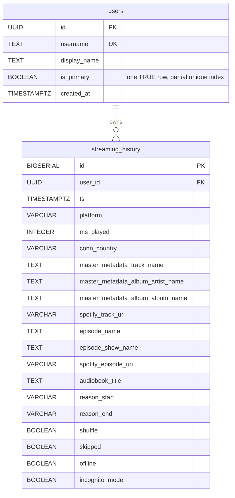

# Database Schema Diagram

**Updated:** Phase 11 (2026-09-01), replacing a pre-Phase-0 draft that described tables
(`user_statistics`, `user_similarities`, `recommendations`) that were never actually
implemented by any migration. This version reflects the schema as it exists on disk
today: `apps/api/migrations/001`–`010`.

For the medallion architecture, natural keys, and design decisions behind the `gold.*`
star schema, see `documentation/DATA_MODEL.md`. This file is the column-level ER
reference.

---

## Legacy tables (migrations 001–007) — still the primary write path



`ip_addr INET` was a column on `streaming_history` until Phase 9 dropped it (third-party
PII, purged from history too — see `SECURITY.md`). It must never be reintroduced into
any new layer; migrations 008/009 say so explicitly in their own comments.

Two materialized views (`monthly_stats`, `top_artists`, `top_tracks` — the third is
`top_tracks`) are derived from this table, defined in migration 003 and **redefined by
migration 010** to read `gold.fact_streams` instead (same names, same output columns,
same query shape from the caller's perspective — see below).

Migration 006 adds ~20 analytics functions (`get_milestones_list`, `get_flashback`,
`get_artist_loyalty`, `_mood_rows`, etc.). **8 of them + the 3 MVs were repointed at
`gold.fact_streams` in migration 010; the rest still read `streaming_history` directly**
— this is a deliberate partial migration, see `DATA_MODEL.md`'s "Partial rewrite scope."

---

## Medallion layers (migrations 008–010, Phase 11)

```mermaid
erDiagram
    bronze_raw_streams {
        BIGSERIAL _ingest_id PK
        TEXT _source_file
        TIMESTAMPTZ _ingested_at
        JSONB _raw
        UUID user_id FK
        TIMESTAMPTZ ts
        TEXT master_metadata_track_name
        TEXT master_metadata_album_artist_name
        VARCHAR spotify_track_uri
        INTEGER ms_played
    }
    silver_streams {
        BIGSERIAL stream_id PK
        BIGINT _ingest_id FK
        UUID user_id FK
        TIMESTAMPTZ ts
        TEXT artist_key "lower(trim(artist_name))"
        TEXT track_key "uri or hash: fallback"
        TEXT track_name
        TEXT artist_name
        TEXT album_name
        INTEGER ms_played
        BOOLEAN is_music
    }
    bronze_raw_streams ||--o{ silver_streams : normalizes_into

    gold_dim_user {
        UUID user_id PK "reuses users.id verbatim"
        TEXT username
        BOOLEAN is_primary
    }
    gold_dim_time {
        INTEGER time_key PK "YYYYMMDD*100+hour"
        DATE date
        SMALLINT hour
        BOOLEAN is_weekend
    }
    gold_dim_artist {
        TEXT artist_key PK "lower(trim(artist_name))"
        TEXT artist_name
        TEXT spotify_artist_id
        TEXT_ARRAY genres "from artists_info.json"
        TEXT_ARRAY genres_enriched "from backfill_artist_tags.py"
        INTEGER popularity
        BIGINT followers
        TEXT audio_source "none|enriched|proxy_heuristic"
    }
    gold_dim_track {
        TEXT track_key PK "uri or hash: fallback"
        TEXT spotify_track_uri
        TEXT track_name
        TEXT artist_key FK
        INTEGER duration_ms
        BOOLEAN explicit
        SMALLINT release_year
        NUMERIC mood_proxy_valence "UNPOPULATED, Decision D1"
        NUMERIC mood_proxy_energy "UNPOPULATED, Decision D1"
        NUMERIC mood_proxy_danceability "UNPOPULATED, Decision D1"
        TEXT audio_source "none|enriched|proxy_heuristic"
    }
    gold_dim_album {
        TEXT album_key PK "album+artist_key"
        TEXT album_name
        TEXT artist_key FK
    }
    gold_fact_streams {
        BIGSERIAL stream_id PK
        BIGINT _ingest_id "traces to bronze"
        UUID user_id FK
        INTEGER time_key FK
        TEXT artist_key FK
        TEXT track_key FK
        TEXT album_key FK
        TEXT artist_name "denormalized, raw casing"
        TEXT track_name "denormalized, raw casing"
        TEXT album_name "denormalized, raw casing"
        TIMESTAMPTZ ts
        INTEGER ms_played
        BOOLEAN skipped
        BOOLEAN is_music
    }
    gold_track_lyrics {
        TEXT track_key PK FK
        BOOLEAN has_lyrics
        TEXT source "e.g. genius; provenance only"
        TEXT lang "NULL, no detector dependency"
        INTEGER word_count
    }
    gold_recommendation_events {
        BIGSERIAL event_id PK
        UUID user_id FK
        TEXT track_key FK
        TEXT recommender "Phase 15"
        SMALLINT rating "Phase 15 human-eval"
    }

    silver_streams ||--o{ gold_fact_streams : "1:1, no dedup (D6)"
    gold_dim_user ||--o{ gold_fact_streams : has
    gold_dim_time ||--o{ gold_fact_streams : has
    gold_dim_artist ||--o{ gold_fact_streams : has
    gold_dim_track ||--o{ gold_fact_streams : has
    gold_dim_album ||--o{ gold_fact_streams : has
    gold_dim_track ||--o| gold_track_lyrics : has
    gold_dim_track ||--o{ gold_recommendation_events : recommended_as
```

### Compatibility views (Blocker B1)

`public.gold_fact_streams`, `public.gold_dim_user`, `public.gold_dim_time`,
`public.gold_dim_artist`, `public.gold_dim_track`, `public.gold_dim_album`,
`public.gold_track_lyrics` — unqualified `SELECT * FROM gold.<table>` views in `public`,
so `apps/api/app/db/backends.py`'s `LocalBackend.select()` (which rejects dotted
identifiers by design) never needs to reach a schema-qualified name. Not used by any
Phase 11 RPC internally — RPCs qualify `gold.*` directly in their SQL bodies, which was
always safe.

---

## Index strategy (as implemented)

```
streaming_history           gold.fact_streams              silver.streams
  idx_streaming_user_ts       idx_fact_streams_user_ts        idx_silver_streams_user_ts
  idx_streaming_user_artist   idx_fact_streams_user_artist    idx_silver_streams_user_artist
  idx_streaming_user_track    idx_fact_streams_user_track     idx_silver_streams_user_track
  idx_streaming_user_platform idx_fact_streams_time_key
  idx_streaming_user_music_only idx_fact_streams_ingest_id
                               idx_fact_streams_user_artist_name
                               idx_fact_streams_user_track_name

gold.dim_artist                        gold.dim_track
  PK (artist_key)                        PK (track_key)
  idx_dim_artist_spotify_id              idx_dim_track_uri
                                          idx_dim_track_artist_key
                                          idx_dim_track_audio_source

bronze.raw_streams
  PK (_ingest_id)
  idx_bronze_raw_streams_user_ts
  idx_bronze_raw_streams_source
```

Materialized views (`monthly_stats`, `top_artists`, `top_tracks`) each carry a unique
index on `(user_id, <natural grouping key>)`, required for
`REFRESH MATERIALIZED VIEW CONCURRENTLY` (used by `refresh_all_views()`, migration 004).

---

## Query patterns (representative)

**Overview stats** (migration 010, reads `gold.fact_streams`):
```sql
SELECT COUNT(*), SUM(ms_played)/3600000.0,
       COUNT(DISTINCT track_name), COUNT(DISTINCT artist_name)
FROM gold.fact_streams
WHERE user_id = _effective_user_id($1)
  AND track_key IS NOT NULL AND track_key NOT LIKE 'hash:%';
```

**Top artists** (materialized view, migration 010):
```sql
SELECT artist, streams, hours, percentage
FROM top_artists
WHERE user_id = _effective_user_id($1)
ORDER BY stream_count DESC LIMIT $2;
```

**Mood summary** (`_mood_rows`, migration 010 — arithmetic heuristic, not audio
features; see `DATA_MODEL.md`'s Decision D1):
```sql
SELECT window_days, avg_valence, avg_energy, avg_danceability, sample_size
FROM get_mood_summary($window_days, $user_id);
-- internally: SELECT * FROM _mood_rows($user_id) WHERE ts >= now() - interval ...
```

**Milestones** (migration 006, still reads `streaming_history` — out of Phase 11's scope):
```sql
SELECT * FROM get_milestones_list($user_id);
```

---

## Not implemented (removed from this doc)

The pre-Phase-11 version of this file described `user_statistics`,
`user_similarities`, and `recommendations` tables with UNIQUE constraints and
dedicated indexes. **None of these were ever created by any migration** — Phase 5's
comparison feature (`/api/compare/*`) computes overlap/similarity in Python from the
`top_artists` materialized view at request time instead (see
`apps/api/app/services/supabase_data_loader.py`'s `get_overlap`/`get_similarity_matrix`),
and there is no persisted recommendations table — `/api/reco` computes recommendations
on the fly per request. If either becomes a real persisted table in a later phase,
document it here then.
